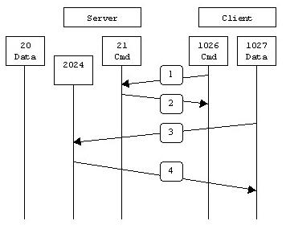

# ftp和sftp区别
## 链接方式不同
FTP 使用 TCP 端口 21 上的控制连接建立连接。而 SFTP 是在客户端和服务器之间通过 SSH 协议 (TCP 端口 22) 建立的安全连接来传输文件。

## 安全性不同
SFTP 使用加密传输认证信息和传输的数据，所以使用 SFTP 相对于 FTP 是非常安全。

## 效率不同
SFTP 这种传输方式使用了加密解密技术，所以传输效率比普通的 FTP 要低得多。

## 协议不同
FTP 使用 TCP / IP 协议。而，SFTP 是 SSH 协议的一部分，它是一种远程登录信息。

## 安全通道
FTP 不提供任何安全通道来在主机之间传输文件；而 SFTP 协议提供了一个安全通道，用于在网络上的主机之间传输文件。

# ftp主被动模式区别
## 总结
下面的图表会帮助管理员们记住每种FTP方式是怎样工作的：  
**主动FTP**  
   　　命令连接：客户端 >1023端口 -> 服务器 21端口  
   　　数据连接：客户端 >1023端口 <- 服务器 20端口  
**被动FTP**  
   　　命令连接：客户端 >1023端口 -> 服务器 21端口  
   　　数据连接：客户端 >1023端口 -> 服务器 >1023端口  
## 主动模式
主动模式下，FTP客户端从任意的非特殊的端口(N > 1023)连入到FTP服
器的命令端口--21端口。然后客户端在N+1(N+1 >= 1024)端口监听，并
通过N+1(N+1 >= 1024)端口发送命令给FTP服务器。服务器会反过来连接
户本地指定的数据端口，比如20端口。
&emsp;&emsp;以服务器端防火墙为立足点，要支持主动模式FTP需要打开如下交互中使用到的端口：
- FTP服务器命令(21)端口接受客户端任意端口(客户端初始连接)
- FTP服务器命令(21)端口到客户端端口(>1023)(服务器响应客户端命令)
- FTP服务器数据(20)端口到客户端端口(>1023)(服务器初始化数据连接到客户端数据端口)
- FTP服务器数据(20)端口接受客户端端口(>1023)(客户端发送ACK包到服务器的数据端口)   

用图表示如下：  

1. 客户端的命令端口与FTP服务器的命令端口建立连接，并发送命令“PORT 1027”。
2. FTP服务器给客户端的命令端口返回一个"ACK"。
3. FTP服务器发起一个从它自己的数据端口(20)到客户端先前指定的数据端口(1027)的连接。
4. 最后客户端给服务器端返回一个"ACK"。
::: info 注意
主动方式FTP的主要问题实际上在于客户端。FTP的客户端并没有实际建立一个到服务器数据端口的连接，它只是简单的告诉服务器自己监听的端口号，服务器再回来连接客户端这个指定的端口。对于客户端的防火墙来说，这是从外部系统建立到内部客户端的连接，这是通常会被阻塞的。
:::

## 被动模式
&emsp;&emsp;为了解决服务器发起到客户的连接的问题，人们开发了一种不同的FTP连接方式。这就是所谓的被动方式，或者叫做PASV，当客户端通知服务器它处于被动模式时才启用。
&emsp;&emsp;在被动方式FTP中，命令连接和数据连接都由客户端，这样就可以解决从服务器到客户端的数据端口的入方向连接被防火墙过滤掉的问题。当开启一个FTP连接时，客户端打开两个任意的非特权本地端口(N >; 1024和N+1)。第一个端口连接服务器的21端口，但与主动方式的FTP不同，客户端不会提交PORT命令并允许服务器来回连它的数据端口，而是提交PASV命令。这样做的结果是服务器会开启一个任意的非特权端口(P >; 1024)，并发送PORT P命令给客户端。然后客户端发起从本地端口N+1到服务器的端口P的连接用来传送数据。
&emsp;&emsp;对于服务器端的防火墙来说，必须允许下面的通讯才能支持被动方式的FTP:
- FTP服务器命令(21)端口接受客户端任意端口(客户端初始连接)
- FTP服务器命令(21)端口到客户端端口(>1023)(服务器响应客户端命令)
- FTP服务器数据端口(>1023)接受客户端端口(>1023)(客户端初始化数据连接到服务器指定的任意端口)
- FTP服务器数据端口(>1023)到客户端端口(>1023)(服务器发送ACK响应和数据到客户端的数据端口) 
用图表示如下：  
  
1. 客户端的命令端口与服务器的命令端口建立连接，并发送命令“PASV”。
2. 服务器返回命令"PORT 2024"，告诉客户端（服务器）用哪个端口侦听数据连接。
3. 客户端初始化一个从自己的数据端口到服务器端指定的数据端口的数据连接。
4. 最后服务器给客户端的数据端口返回一个"ACK"响应。  
    
&emsp;&emsp;被动方式的FTP解决了客户端的许多问题，但同时给服务器端带来了更多的问题。最大的问题是需要允许从任意远程终端到服务器高位端口的连接。幸运的是，许多FTP守护程序，包括流行的WU-FTPD允许管理员指定FTP服务器使用的端口范围。详细内容参看附录1。  
&emsp;&emsp;第二个问题是客户端有的支持被动模式，有的不支持被动模式，必须考虑如何能支持这些客户端，以及为他们提供解决办法。例如，Solaris提供的FTP命令行工具就不支持被动模式，需要第三方的FTP客户端，比如ncftp。  
&emsp;&emsp;随着WWW的广泛流行，许多人习惯用web浏览器作为FTP客户端。大多数浏览器只在访问ftp://这样的URL时才支持被动模式。这到底是好还是坏取决于服务器和防火墙的配置。   


::: info 备注
　　有读者指出，当NAT(Network Address Translation)设备以主动模式访问FTP服务器时，由于NAT设备不会聪明的变更FTP包中的IP地址，从而导致无法访问服务器。
:::

# tls安全验证
在```/etc/vsftp/vsftp.conf```中做如下修改

```text
pam_service_name=vsftpd
userlist_enable=YES
tcp_wrappers=YES
require_ssl_reuse=NO
listen=YES
listen_ipv6=NO
pasv_enable=YES
pasv_min_port=49000
pasv_max_port=50000
#pasv_address=101.91.136.47
pasv_address=192.168.100.88
#pasv_address=ftp.sectrend.com.cn
pasv_promiscuous=YES  # 允许pasv被动模式ip混乱，防火墙nat映射到本机需要开启，要不然会报错 ftplib.error_temp: 425 Security: Bad IP connecting.

SSL配置
ssl_enable=YES
ssl_tlsv1=YES
ssl_sslv2=YES
ssl_sslv3=YES
allow_anon_ssl=YES
force_local_data_ssl=YES
force_local_logins_ssl=YES
rsa_cert_file=/etc/vsftpd/sectrend.com.cn.pem
rsa_private_key_file=/etc/vsftpd/sectrend.com.cn.key
```

## 添加用户
```bash
sudo useradd -m -s /bin/bash ftpuser
echo "sftp@1qaz" | sudo passwd --stdin ftpuser
```
## 被动模式LIST指令无响应
检查firewalld端口开放情况
## python连接demo代码
```python
import ftplib
import ssl


ftp_client=ftplib.FTP_TLS()
#ftp_client.set_pasv(False)
ftp_client.connect(host='ftp.sectrend.com.cn', port=2221)
#ftp_client.connect(host='192.168.100.88', port=21)
ftp_client.login(user='ftpuser', passwd='sftp@1qaz')
ftp_client.prot_p()


print("ftp连接成功.......")
# 执行FTP操作
# 例如：列出FTP服务器上的文件
ftp_client.retrlines('LIST')

# 关闭FTP连接
ftp_client.quit()

```